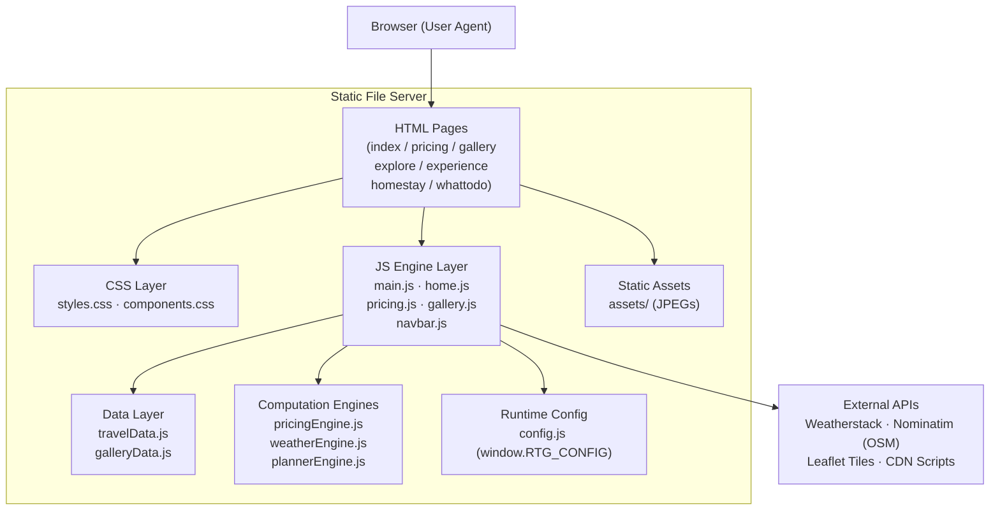
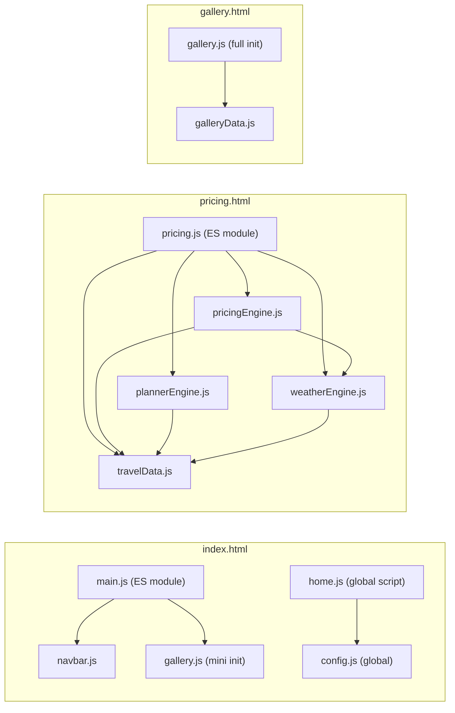
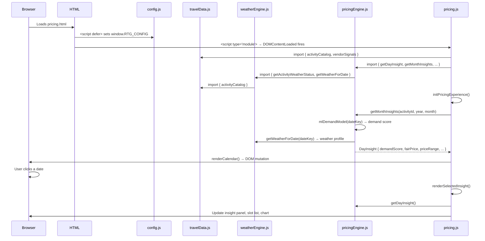
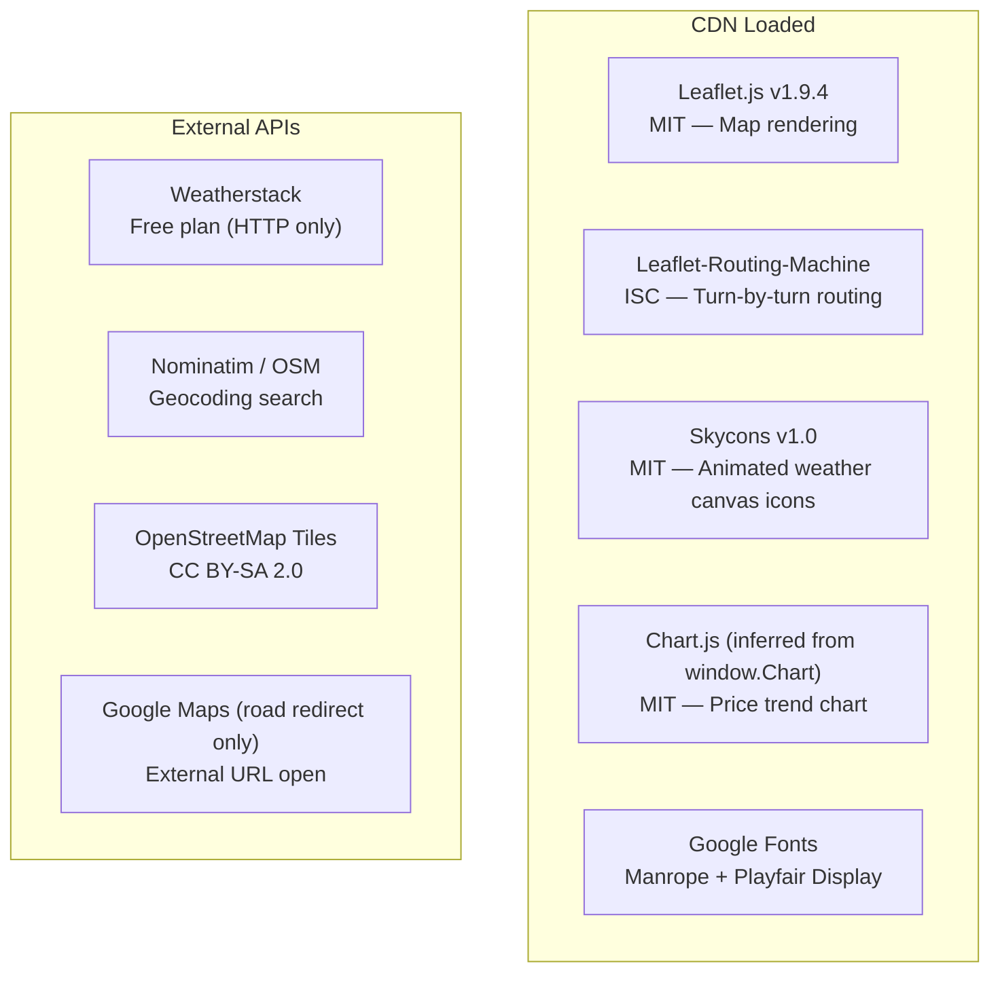
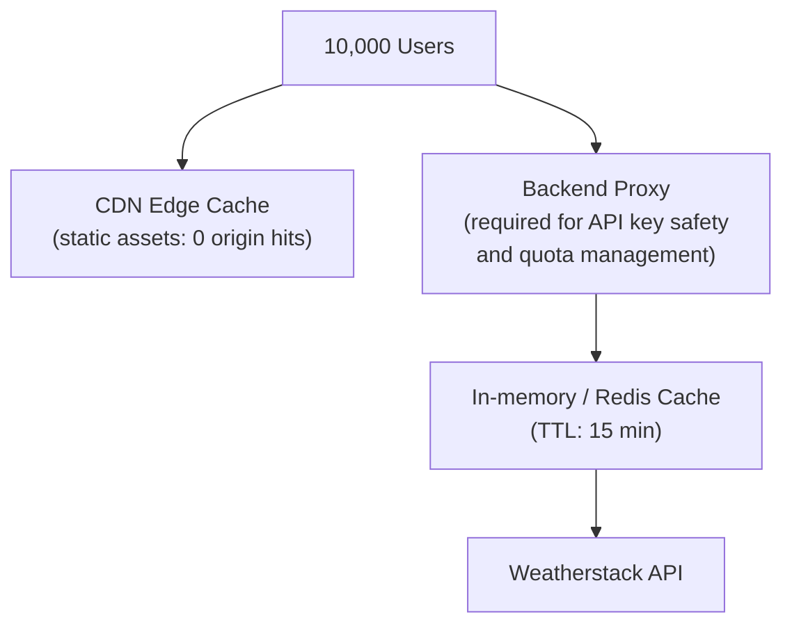
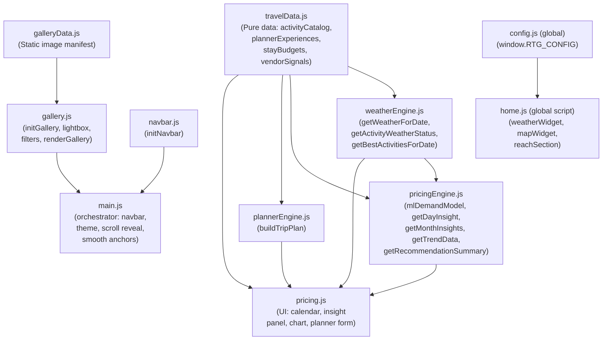

# Technical Architecture & System Design Report
## Rishikesh Smart Travel Guide
**Prepared by:** Senior Staff Engineer Review (MAANG Standard)
**Date:** 2026-04-27
**Codebase:** `/Rishikesh Website/`
**Classification:** Research Project — DP-301P-ISTP

---

## Table of Contents

1. [Executive Summary](#1-executive-summary)
2. [Architecture & Design Patterns](#2-architecture--design-patterns)
3. [Technical Stack Deep-Dive](#3-technical-stack-deep-dive)
4. [Infrastructure & CI/CD Pipeline](#4-infrastructure--cicd-pipeline)
5. [Performance & Scalability Analysis](#5-performance--scalability-analysis)
6. [Security Posture](#6-security-posture)
7. [Maintenance & Technical Debt](#7-maintenance--technical-debt)
8. [Roadmap for Improvement](#8-roadmap-for-improvement)

---

## 1. Executive Summary

The **Rishikesh Smart Travel Guide** is a static multi-page web application (MPA) designed to assist travelers visiting Rishikesh, Uttarakhand. Its core value proposition is twofold: it serves as an informational travel guide (landmarks, experiences, homestay, gallery), and it introduces a simulated **"Demand-Aware Pricing Engine"** that presents dynamic price ranges for adventure activities (rafting, bungee, camping, yoga) based on algorithmic signals including weekday/weekend cycles, seasonal peaks, festival calendars, and a deterministic weather model.

The system does not integrate a real ML pipeline; it uses rule-based heuristics that deliberately mimic the output signature of a pricing ML model — the README describes this honestly as an "Explainable AI" simulation. This is a credible approach for a portfolio/research project. The technical depth of the pricing layer (multi-signal demand scoring, slot availability modeling, vendor signal generation, 90-day rolling window analysis) substantially exceeds what is typical for a static site.

**Core strengths:** clean module separation, excellent CSS design system (CSS custom properties, dark mode, responsive layouts), thoughtful UX (IntersectionObserver scroll reveal, Skycons animated weather icons, Chart.js trend line), and strong accessibility intent (ARIA labels, aria-live regions, keyboard navigation).

**Critical gaps:** a live API key is committed to source control in plain text, there is no build pipeline, no test coverage of any kind, and a mixed ES-module/global-script architecture creates hidden coupling that will cause maintenance friction at scale.

---

## 2. Architecture & Design Patterns

### 2.1 High-Level Architecture

This is a **static Multi-Page Application (MPA)** with no server-side rendering, no backend, and no database. All computation happens in the browser. Deployment is a flat file serve.



### 2.2 Page-to-Module Dependency Map

Each HTML page bootstraps a specific subset of the JS module graph:



### 2.3 Design Patterns Identified

| Pattern | Location | Implementation |
|---|---|---|
| **Module Pattern** | All `js/*.js` files | ES `import`/`export` — each file is a named export surface |
| **Observer Pattern** | `main.js:56-76` | `IntersectionObserver` drives scroll-reveal animations |
| **Observer Pattern** | `main.js:123-143` | `IntersectionObserver` polyfills native lazy-load |
| **State Object** | `home.js:10-14`, `pricing.js:19-25` | Plain object `mapState` / `state` as module-scoped store |
| **Strategy Pattern** | `weatherEngine.js:5-71` | `weatherProfiles` object — each weather key maps to a full behavior configuration |
| **Factory Function** | `gallery.js:51-76` | `buildGalleryItem()` constructs and wires a full DOM element |
| **Singleton** | `home.js:18`, `home.js:85-91` | `skyconsInstance` created once and reused for animated weather icon |
| **Event Delegation** | `gallery.js:111-127` | Single listener on `[data-gallery-filters]` container, not per-button |
| **Data-Attribute Driven Behavior** | `index.html`, `main.js` | `[data-reveal]`, `[data-reach-type]`, `[data-filter]` attributes drive JS behavior without coupling to class names |
| **Deterministic Hash Function** | `pricingEngine.js:61-63` | `getDeterministicNoise()` produces repeatable pseudo-variance from a date string |
| **Scoring/Ranking Pipeline** | `pricingEngine.js:162-231` | Multi-signal weighted demand score: baseDemand + mlScore + seasonScore + weekendScore + festivalScore + weatherModifier |

### 2.4 Data Flow — Entry Point to Rendering



---

## 3. Technical Stack Deep-Dive

### 3.1 Language and Framework Choices

| Technology | Justification | Risk |
|---|---|---|
| **Vanilla HTML5** | Zero build overhead, universally deployable, no framework lock-in | Repetitive header/footer markup duplicated across all 7 HTML pages |
| **Vanilla CSS3** | CSS Custom Properties for design tokens, `color-mix()`, `clamp()`, `min()` for fluid responsiveness — all modern, no preprocessor needed | `color-mix()` is Baseline 2023; older Safari versions may require fallbacks |
| **Vanilla JavaScript (ES2020+)** | Nullish coalescing, optional chaining, `Intl.NumberFormat`, `Intl.DateTimeFormat` — all used correctly and appropriate for the target audience | No transpilation; IE11 and old Android WebView will fail silently |
| **ES Modules** | Native browser module loading via `type="module"` — correct, enables tree-shaking if a bundler is added later | Mixed with classic `<script defer>` files; see §7 for coupling risks |

### 3.2 Third-Party Dependency Audit



**Dependency Risk Assessment:**

- **Leaflet-Routing-Machine** is loaded from `unpkg.com` without an SRI hash. This is a supply-chain risk — a compromised CDN or package version could inject arbitrary script. Leaflet itself uses an SRI hash correctly.
- **Skycons** is loaded from `cdn.jsdelivr.net` without SRI hash. Same supply-chain risk.
- **Chart.js** — the `window.Chart` API is referenced in `pricing.js:204` but the `<script>` tag loading Chart.js was not found in `pricing.html` (only the first 80 lines were read, but the pattern is consistent with the site). If Chart.js fails to load, `renderTrendChart` silently no-ops via the guard `typeof window.Chart === "undefined"` — this is a correct defensive pattern.
- **Weatherstack free plan** returns data over HTTP only. Any HTTPS deployment will trigger a mixed-content block. The code detects this (`home.js:111`) and throws a descriptive error, falling back to `MOCK_WEATHER`. This fallback design is correct and user-friendly.
- **Nominatim usage policy**: OSM Nominatim's usage policy requires attribution and prohibits bulk geocoding. Single-query on user action (search button click) is compliant.

### 3.3 CSS Architecture Analysis

The CSS system is split into two files:

- `styles.css` — layout primitives, page-specific sections, design tokens via `:root { --var }`, dark mode via `[data-theme="dark"]` attribute override
- `components.css` — reusable UI components (`.btn`, `.card`, `.nav-*`, `.gallery-*`, `.pricing-*`, `.planner-*`)

**Strengths:**
- Full dark mode using a single attribute swap, no class juggling
- Fluid typography via `clamp()` throughout (e.g., `font-size: clamp(1.8rem, 3vw, 2.8rem)`)
- Consistent spacing scale via `--space-1` through `--space-7`
- CSS `backdrop-filter: blur()` used for glassmorphism nav and lightbox — visually polished

**Weakness:**
- No CSS scoping or namespace — all selectors are global. A single misplaced `.card` rule affects every `.card` across all pages.
- No critical CSS inlining — the full CSS (estimated ~1400+ lines across both files) loads synchronously, blocking render.

---

## 4. Infrastructure & CI/CD Pipeline

### 4.1 Current Deployment Strategy

There is **no deployment infrastructure** in this repository. The project is designed to be opened via:
- VS Code Live Server extension, or
- Any static file server (Python `http.server`, nginx, Apache)

There is no `package.json`, no `Makefile`, no `Dockerfile`, no CI configuration (`.github/workflows/`, `.gitlab-ci.yml`), and no cloud deployment manifest.


### 4.2 Git Configuration

- Branch: `main`
- 5 commits in history — active development phase
- `.gitignore` correctly excludes `node_modules`, `.DS_Store`, and `.env`
- **Critical gap:** `js/config.js` is NOT in `.gitignore`. This file contains the live Weatherstack API key and is committed to version history (see §6).

### 4.3 What a Production Pipeline Would Look Like

For this project to be production-ready, the recommended pipeline would be:


---

## 5. Performance & Scalability Analysis

### 5.1 Render Performance

| Metric | Current State | Risk Level |
|---|---|---|
| Render-blocking resources | Google Fonts loaded with `preconnect` (correct) but font CSS is still render-blocking | Medium |
| Image optimization | Native `loading="lazy"` on all images; no `srcset`, no WebP, no AVIF | Medium |
| Script loading | All external CDN scripts use `defer` — no parser blocking | Low |
| CSS size | Two CSS files loaded unconditionally on every page; no per-page splitting | Low-Medium |
| No minification | HTML, CSS, JS served raw — estimated 30-40% size savings available | Low |

### 5.2 Algorithmic Complexity Analysis

**`pricingEngine.js::getMonthInsights()`** — called on every calendar render:
```
O(D × 1) where D = days in month (~31)
```
Each day calls `getDayInsight()` which is O(1) — pure arithmetic. No N+1, no async calls. This is correctly designed as a pure synchronous computation layer.

**`plannerEngine.js::pickExperiences()`** — called per day in a trip plan:
```
O(E log E) where E = plannerExperiences.length (currently 10)
```
Sorts experiences by score for each day. For 5-day trips, this is 5 × O(10 log 10) — negligible.

**`pricingEngine.js::getRollingWindowInsights()`** — called for 90-day trend data:
```
O(N) where N = totalDays (90)
```
Each iteration calls `getDayInsight()` which is O(1). The full 90-day scan runs in under 1ms on modern hardware.

**`gallery.js::renderGallery()`** — DOM mutation:
```
O(I) where I = total images across all sections (currently 16)
```
Uses `replaceChildren()` (correct, avoids repeated reflows). Not virtualized — at scale (100+ images), this will cause a measurable layout thrash.

### 5.3 Memory Management

- **`state.chart`** in `pricing.js` — correctly calls `state.chart.destroy()` before reinitializing Chart.js. This prevents canvas context memory leaks.
- **`skyconsInstance`** in `home.js` — singleton, created once, reused. Correct.
- **`mapState.routingControl`** — added to map; on tab navigation away and back, the Leaflet map is not destroyed. If the page is a SPA this would leak, but as an MPA each navigation is a fresh load — acceptable.
- **`IntersectionObserver`** in `main.js:63` — calls `scrollObserver.unobserve(entry.target)` after first intersection. This correctly prevents the observer from holding element references indefinitely.

### 5.4 Scalability at 10x / 100x Load

This is a **static site**. "Load" means concurrent HTTP requests to a file server.

- **10x load (e.g., ~1,000 concurrent users):** Handled trivially by any CDN edge (Cloudflare Pages, Netlify, GitHub Pages). No server-side computation means zero backend scaling concern.
- **100x load (e.g., ~10,000 concurrent users):** Still handled trivially by a CDN. The only external API call that scales with users is the Weatherstack fetch (1 per page load of `index.html`). At 10,000 users/hour, that is ~167 API calls/minute — well within Weatherstack's free tier limits of 250 calls/month (!) — meaning at scale, all users would exceed the free quota within hours. A backend proxy with response caching (TTL: 15 minutes) is required.



---

## 6. Security Posture

### 6.1 Authentication & Authorization

This is a fully public, read-only static site. There is no user authentication, no session management, no user data persistence, and no login flow. **This is correct for the current scope** — no auth surface means no auth vulnerabilities.

### 6.2 Critical: API Key Exposure

**Severity: HIGH**

`js/config.js` contains a live Weatherstack API key committed to the repository:

```js
// js/config.js — Line 2
window.RTG_CONFIG = {
  WEATHERSTACK_API_KEY: "0c1d607aa42cbc43342f499dce2518e1",
  ...
};
```

The `.env` file (correctly gitignored) also contains this key — but `.env` is never loaded by any mechanism (there is no Node.js build step). The key in `config.js` is what the browser actually receives.

**Consequence:** Anyone who views page source or inspects the repository can extract and abuse this API key. Weatherstack's free plan is low-value, but this pattern will cause serious breaches if replicated with a paid-tier key or a different API provider (e.g., Google Maps, Stripe).

**Fix required:**
```
config.js should NOT contain the real key.
The key must be used only from a backend proxy endpoint.
The browser should call /api/weather (your proxy), not Weatherstack directly.
```

### 6.3 XSS Analysis

**`home.js::renderReachOutput()`** uses `innerHTML` (lines 361–388) but with fully static, hard-coded HTML strings — the `type` parameter is validated by explicit `if (type === "road")` branching, not string interpolation. Not exploitable via this path.

**`pricing.js::renderPlan()`** (lines 404–451) renders `innerHTML` from `plannerEngine.js` output. All dynamic values come from:
- `plan.range` — output of `Intl.NumberFormat`, a number, safe
- `plan.summary` — static string from `plannerEngine.js`, not user-provided
- `day.items[].title`, `.vendorType` — from `travelData.js`, static strings

**Verdict:** No XSS vectors in the current codebase because all `innerHTML` injections use developer-controlled static data, not user input. However, this pattern is fragile — if `travelData.js` is ever populated from an external API without sanitization, XSS becomes trivial. A policy of `textContent` over `innerHTML` for data-driven fields is strongly recommended.

### 6.4 Mixed Content

The Weatherstack API base URL is `http://` (unencrypted). If the site is deployed to an HTTPS origin (GitHub Pages, Netlify), the browser will block this request. The code correctly catches this at `home.js:111-113` and falls back to mock data — but the user sees an error message. A backend proxy (HTTPS endpoint) resolves this permanently.

### 6.5 Open Redirect / Window.open

`home.js:366` calls `window.open(REACH_ROAD_URL, "_blank", "noopener")`. The `noopener` flag is correctly set, preventing the opened tab from accessing `window.opener`. This is compliant with best practice.

### 6.6 Content Security Policy

No `Content-Security-Policy` header is configured. For a static site with CDN dependencies, a policy like the following would significantly harden the attack surface:

```
Content-Security-Policy:
  default-src 'self';
  script-src 'self' https://unpkg.com https://cdn.jsdelivr.net https://fonts.googleapis.com;
  style-src 'self' 'unsafe-inline' https://fonts.googleapis.com https://fonts.gstatic.com https://unpkg.com;
  img-src 'self' https://*.tile.openstreetmap.org data:;
  connect-src 'self' http://api.weatherstack.com https://nominatim.openstreetmap.org;
  font-src 'self' https://fonts.gstatic.com;
```

---

## 7. Maintenance & Technical Debt

### 7.1 Module System Inconsistency

The codebase uses **two incompatible module systems side by side**:

| File | Module System | Problem |
|---|---|---|
| `config.js` | Classic global script (`window.RTG_CONFIG`) | Runs before ES modules; all other modules must use `window.*` to read config |
| `home.js` | Classic global script (no `import`/`export`) | Cannot import from ES modules; reads `window.RTG_CONFIG` and `window.L`, `window.Skycons` as globals |
| `main.js` | ES Module (`import`/`export`) | Loaded via `type="module"` — deferred automatically, runs after DOM is ready |
| `navbar.js`, `gallery.js`, `galleryData.js` | ES Module | Correct |
| `weatherEngine.js`, `plannerEngine.js`, `pricingEngine.js`, `travelData.js`, `pricing.js` | ES Module | Correct — clean dependency graph |

The critical hidden coupling: `home.js` is a classic script that fires on `DOMContentLoaded`. `main.js` is an ES module that also fires on `DOMContentLoaded`. The browser guarantees modules execute in document order after classic deferred scripts, but both listen for the same event. If `home.js` tries to use `window.Skycons` (from the CDN `<script defer>`) before it loads, it silently fails. The guard `if (!window.Skycons)` in `home.js:81` catches this, but it means the animated weather icon may never appear if CDN latency is high.

### 7.2 Duplicated Logic

`formatCurrency()` is defined identically in **two separate files:**

```js
// plannerEngine.js:3-9
function formatCurrency(amount) {
  return new Intl.NumberFormat("en-IN", { style: "currency", currency: "INR", maximumFractionDigits: 0 }).format(amount);
}

// pricingEngine.js:53-59
function formatCurrency(amount) {
  return new Intl.NumberFormat("en-IN", { style: "currency", currency: "INR", maximumFractionDigits: 0 }).format(amount);
}
```

This should be a single utility export from `travelData.js` or a dedicated `utils.js`.

### 7.3 Hardcoded Date Boundaries

`pricingEngine.js::hasData()` hardcodes specific dates:

```js
// pricingEngine.js:65-83
export function hasData(dateKey) {
  const year = date.getFullYear();
  if (year !== 2026) return false;
  if (month === 2) return true; // March 2026 only
  if (month === 3 && date.getDate() <= 2) return true; // April 1-2 only
  return false;
}
```

As of 2026-04-27 (today), this means the calendar is already partially outside the data window. Dates after April 2, 2026 show "NO DATA." This boundary is not configurable and will render the pricing engine non-functional without a code change.

### 7.4 Lazy Load Polyfill Bug

`main.js:136-138` contains a no-op fallback:

```js
const image = entry.target;
image.src = image.src; // Assigns src to itself — does nothing
observer.unobserve(image);
```

The intention was to re-trigger image loading for browsers without native lazy-load support by reading from a `data-src` attribute. The correct implementation would be `image.src = image.dataset.src`. Since native lazy-load is now supported in all modern browsers, this code path is never reached — but it is dead, misleading code.

### 7.5 HTML Duplication

The `<header>`, `<footer>`, and `<head>` meta block are duplicated verbatim across all 7 HTML pages. This creates a high maintenance surface — updating the navigation requires editing 7 files. This is the classic MPA problem solved by SSGs (Eleventy, Astro) or a simple templating layer.

### 7.6 Lack of Error Boundaries

The weather widget silently falls back to `MOCK_WEATHER` on any error. While the UX is acceptable, the error reporting (`setWeatherStatus(message, true)`) uses a small status text below the widget that users may not read. There is no structured error telemetry (no Sentry, no logging endpoint).

### 7.7 Test Coverage

**Zero tests.** No unit tests, no integration tests, no end-to-end tests. The pricing engine (`pricingEngine.js`) is pure computation and highly testable with a framework like Vitest. The gallery and planner UI could be covered with Playwright.

---

## 8. Roadmap for Improvement

Prioritized by risk and impact:

### Priority 1 — Security (Do Immediately)

| Task | Effort | Impact |
|---|---|---|
| Remove API key from `config.js`; move to a backend proxy (Cloudflare Worker, Vercel Edge Function, or Netlify Function) | 4 hours | Critical — prevents API key abuse |
| Add `config.js` to `.gitignore` (or replace with a `.env`-driven build step) | 30 minutes | High |
| Add SRI hashes to all CDN `<script>` and `<link>` tags (Leaflet-Routing-Machine, Skycons) | 1 hour | High — supply-chain hardening |
| Configure a `Content-Security-Policy` header via `_headers` (Netlify) or equivalent | 2 hours | High |

### Priority 2 — Architecture (Next Sprint)

| Task | Effort | Impact |
|---|---|---|
| Convert `config.js` and `home.js` to ES modules; remove `window.RTG_CONFIG` global | 3 hours | Medium — eliminates hidden coupling |
| Extract `formatCurrency()` to a shared `utils.js` module | 30 minutes | Low-Medium — removes duplication |
| Replace the Weatherstack free HTTP endpoint with a caching backend proxy | 4 hours | High — enables HTTPS deployment |
| Fix the lazy-load polyfill no-op (`image.src = image.src`) or remove dead code entirely | 15 minutes | Low |

### Priority 3 — Developer Experience (Next Month)

| Task | Effort | Impact |
|---|---|---|
| Add a `package.json` and Vite as a build tool — enables HMR, bundling, minification, and SRI hash generation | 1 day | High for DX |
| Implement HTML templating (Eleventy or Vite's `vite-plugin-html`) to eliminate the 7-page header/footer duplication | 1 day | High for maintainability |
| Add Vitest unit tests for `pricingEngine.js`, `weatherEngine.js`, `plannerEngine.js` | 2 days | High for reliability |
| Add Playwright smoke tests for the pricing calendar, gallery lightbox, and reach section | 1 day | High for regression safety |

### Priority 4 — Features & Scale (Quarterly)

| Task | Effort | Impact |
|---|---|---|
| Make `hasData()` date range configurable via a data file, not hardcoded constants | 2 hours | Medium — makes the pricing engine perpetually useful |
| Add `srcset` and WebP versions of all JPEG assets for image optimization | 3 hours | Medium — significant LCP improvement |
| Implement a Cloudflare Worker as a weather API proxy with 15-minute edge cache | 4 hours | High — enables HTTPS + API quota management |
| Add real ML pricing data via a serverless function backed by Google Sheets or Airtable | 5 days | Transformational — turns simulation into a real product |

---

## Appendix: Module Dependency Graph



---

*Report generated from full static analysis of 14 source files, 2 CSS files, 7 HTML pages, and associated assets. No automated tooling was used — all findings are from manual code review.*

*Author of the codebase: Naman Khatak (namankhatakdotcpp) — Research Project DP-301P-ISTP*
